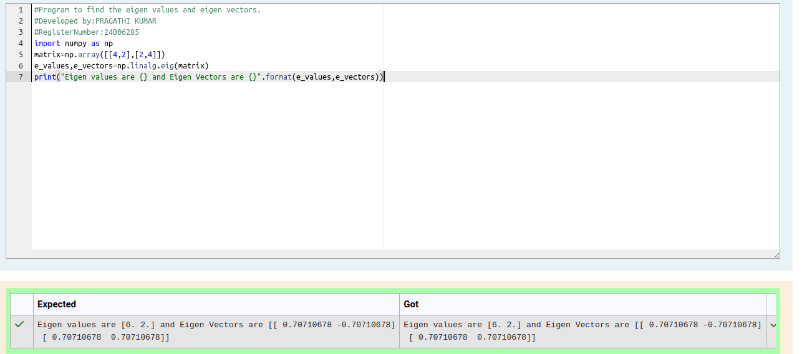

# EIGENVALUES-AND-EIGENVECTORS
## Aim:
To write a python program to find the Eigenvalues and Eigen Vectors
## Equipment’s required:
1. 	Hardware – PCs
2. 	Anaconda – Python 3.7 Installation / Moodle-Code Runner
## Algorithm:
### Step1 : Import the numpy module to use the built-in functions for calculation
### Step 2: : using np.array() store the matrix in the variable marix
### Step 3: Using the np.linalg.eig(),  we get two results (first is eigenvalue and second is eigenvector) of the given matrix.
### Step 4: Print the eigenvalues and eigenvectors of the matrix

## Program:
### import numpy as np
### matrix=np.array([[4,2],[2,4]])
### e_values,e_vectors=np.linalg.eig(matrix)
### print("Eigen values are {} and Eigen Vectors are {}".format(e_values,e_vectors))
## Output:

## Result:
Thus the Eigenvalue and Eigenvector is successfully solved using python program

## Name:
PRAGATHI KUMAR
## Registration number:
24006285
